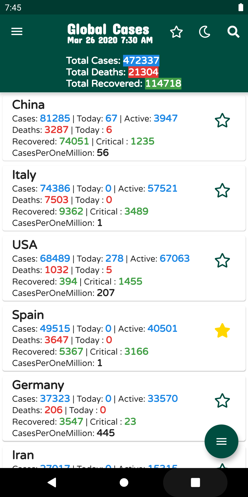
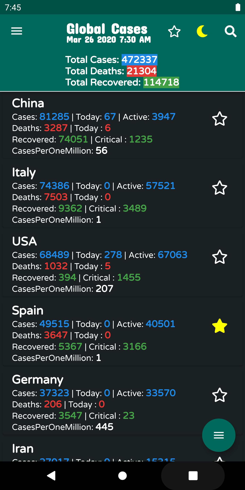
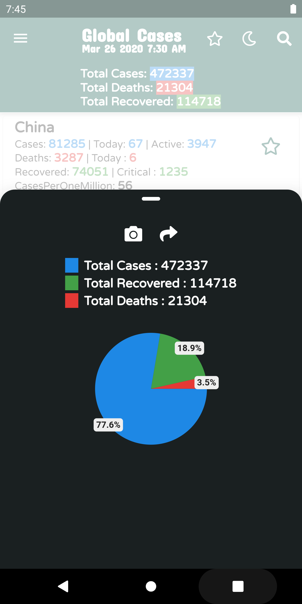
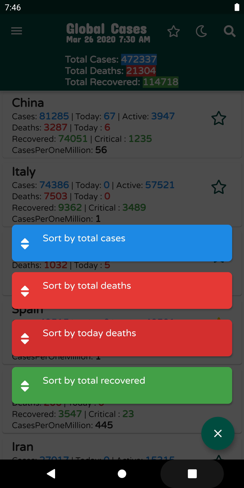
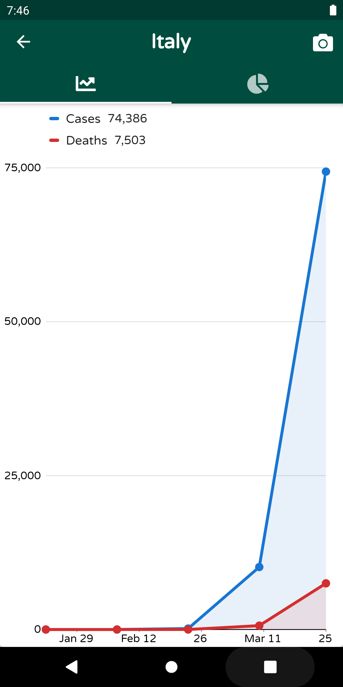

# corova_virus_app
Flutter Andriod app to track cases in each country for Corona Virus Covid-19

app support historical data/dark mode/search by country/charts/share and take screen shot

## APP Youtube Guide
https://www.youtube.com/watch?v=qfjG0Jv313s

## Download app

- [Android](https://github.com/ashishkhuraishy/corova_virus_app/raw/master/output/app-release.apk)

## ScreenShot (support Dark mode)

## Contributions are welcome

## Credits
 - Corona API - [NovelCOVID](https://corona.lmao.ninja/)
 
 
## Getting Started

This project is a starting point for a Flutter application.

A few resources to get you started if this is your first Flutter project:

- [Lab: Write your first Flutter app](https://flutter.dev/docs/get-started/codelab)
- [Cookbook: Useful Flutter samples](https://flutter.dev/docs/cookbook)

For help getting started with Flutter, view our
[online documentation](https://flutter.dev/docs), which offers tutorials,
samples, guidance on mobile development, and a full API reference.
